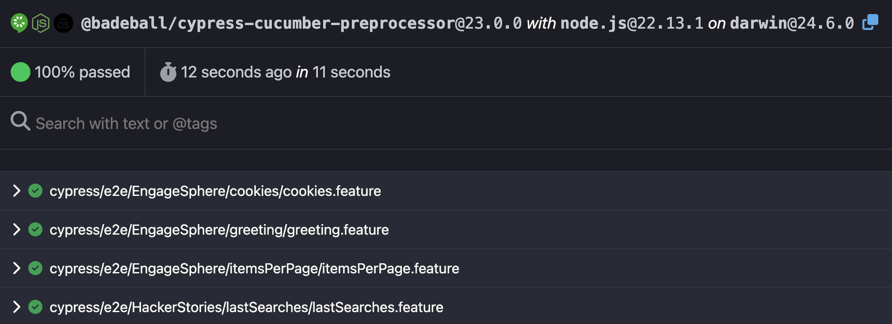

# cucumber-salad

[](https://github.com/wlsf82/cucumber-salad/actions/workflows/ci.yml)

Sample project to integrate Cypress with the Cucumber plugin.

## 🥒 Project Overview

This project demonstrates how to set up end-to-end testing using **Cypress** with **Cucumber** for behavior-driven development (BDD). The tests are written in Gherkin syntax and target multiple applications including EngageSphere and Hacker Stories.

## 📋 Prerequisites

- Node.js (version 20 or higher - LTS)
- npm or yarn package manager

## 🚀 Getting Started

### 1. Clone and Install

```bash
git clone <repository-url>
cd cucumber-salad/
npm install
```

### 2. Running Tests

#### Interactive Mode (Cypress Test Runner)

```bash
npm run cy:open
```

#### Headless Mode (All Tests)

```bash
npm test
```

Below is the result of a successfull execution.

```bash
(Run Finished)


       Spec                                                            Tests  Passing  Failing  Pending  Skipped
  ┌──────────────────────────────────────────────────────────────────────────────────────────────────────────────┐
  │ ✔  EngageSphere/greeting/greeting.feature                 00:02        3        3        -        -        - │
  ├──────────────────────────────────────────────────────────────────────────────────────────────────────────────┤
  │ ✔  EngageSphere/cookies/cookies.feature                   00:01        2        2        -        -        - │
  ├──────────────────────────────────────────────────────────────────────────────────────────────────────────────┤
  │ ✔  EngageSphere/itemsPerPage/itemsPerPage.feature         00:02        4        4        -        -        - │
  ├──────────────────────────────────────────────────────────────────────────────────────────────────────────────┤
  │ ✔  HackerStories/lastSearches/lastSearches.feature        00:01        1        1        -        -        - │
  ├──────────────────────────────────────────────────────────────────────────────────────────────────────────────┤
  │ ✔  HackerStories/removeStories/removeStories.feature      00:01        1        1        -        -        - │
  └──────────────────────────────────────────────────────────────────────────────────────────────────────────────┘
    ✔  All specs passed!                                      00:08       11       11        -        -        -
```

#### Run Smoke Tests Only

```bash
npm run test:smoke
```

#### Run Non-Smoke Tests

```bash
npm run test:not:smoke
```

#### Run EngageSphere Tests Only

```bash
npm run test:engagesphere
```

#### Run Hacker Stories Tests Only

```bash
npm run test:hackerstories
```

#### Generate HTML Report

```bash
npm run test:with:html:report
```

#### Generate HTML Report (Windows)

```bash
npm run test:with:html:report:win
```

The above commands should open a report like the following.



## 🏗️ Project Structure

```text
cypress/
├── e2e/                   # Feature files and step definitions
│   ├── EngageSphere/      # EngageSphere app functionality tests
│   │   ├── cookies/       # Cookie consent functionality tests
│   │   ├── greeting/      # Greeting functionality tests
│   │   └── itemsPerPage/  # Items per page functionality tests
│   └── HackerStories/     # Hacker Stories app functionality tests
│       └── lastSearches/  # Last searches feature tests
│       └── removeStories/ # Remove Stories feature tests
├── screenshots/           # Test failure screenshots
└── support/
  ├── commands.js          # Custom Cypress commands
  ├── e2e.js               # Global test configuration
  └── step_definitions/
    └── common.js          # Shared step definitions
```

## 🧪 Test Features

Below are listed the tests for both the EngageSphere and the Hacker Stories apps.

### EngageSphere

Below are listed the features covered by tests for the EngageSphere app with some of the tests' details.

#### Cookie Consent Banner

- Tests cookie consent banner functionality
- Verifies banner acceptance and decline workflows
- Validates cookie values are properly set

#### Greeting Functionality

- Tests default greeting display
- Tests customized greeting with user input
- Icon display validation based on input values
- Uses data-driven testing with Examples table

#### Items Per Page

- Tests pagination functionality
- Verifies correct number of items displayed per page
- Data-driven tests with multiple page sizes (5, 10, 20, 50)

### Hacker Stories

Below are listed the features covered by tests for the Hacker Stories app with some of the tests' details.

#### Last Searches

- Tests search functionality in the Hacker Stories application
- Validates last search terms are displayed as buttons
- Uses data tables for multiple search term testing

### Remove Stories

Validates that removing a story from the Hacker Stories list updates the count from 20 to 19 stories.

## 🏷️ Test Tags

The project uses Cucumber tags for test organization:

- `@smoke` - Critical functionality tests that run in the smoke test suite
- `@engagesphere` or `@hackerstories` to specify which apps tests should run
- Tests can be filtered using tags in npm scripts

## 📊 Reporting

- HTML reports are generated using the Cucumber preprocessor
- Reports are configured in `.cypress-cucumber-preprocessorrc.json`
- Generated report file: `cucumber-report.html`

## 🔧 Configuration

### Cypress Configuration (`cypress.config.js`)

- Uses ES modules syntax
- Configured with Cucumber preprocessor and esbuild
- Spec pattern set to `**/*.feature` files
- Environment variables for filtering specs

### Cucumber Configuration (`.cypress-cucumber-preprocessorrc.json`)

- HTML reporting enabled
- Additional configuration options available

## 📝 Writing Tests

### Feature Files

Write feature files using Gherkin syntax in the `cypress/e2e/` directory. Examples include:

**Basic Scenario:**

```gherkin
Feature: Feature Name

  Scenario: Test scenario description
    Given I have a precondition
    When I perform an action
    Then I should see the expected result
```

**Data-driven Testing with Examples:**

```gherkin
Feature: Greeting

  @smoke
  Scenario: shows a customized greeting
    When I type "<name>" in the name input field
    Then I see the following greeting: Hi "<name>"!
    And I see the following icon: "<icon>"

    Examples:
      | name     | icon            |
      | Walmyr   | none            |
      | Squirrel | lucide-squirrel |
```

**Data Tables for Multiple Values:**

```gherkin
Feature: Hacker Stories - Last Search

  Scenario: shows the last three searched terms as buttons
    Given I access the Hacker Stories web app
    When I search for these terms
      | Vue | Svelte | Angular |
    Then I see "3" buttons, one for each of the last searched terms
```

### Step Definitions

Implement step definitions in JavaScript files alongside feature files or in the shared `common.js` file:

```javascript
import { Given, When, Then } from '@badeball/cypress-cucumber-preprocessor'

Given('I have a precondition', () => {
  // Implementation
})
```

## 🎯 Target Applications

Tests are designed to run against multiple applications:

### EngageSphere Application

- URL: `https://engage-sphere.vercel.app/`
- Cookie consent functionality
- User greeting interface with customizable names and icons
- Data table with pagination controls

### Hacker Stories Application

- URL: `https://wlsf82-hacker-stories.web.app/`
- Search functionality for Hacker Stories
- Last searches feature with button display
- Dynamic search term management
- Stories removal

## 🪄 Simplified Version Without Cucumber

This branch (`simplified-version-without-cucumber`) demonstrates the same test scenarios implemented using standard Cypress syntax instead of Cucumber/Gherkin. The tests maintain the same functionality and coverage but are written in a more traditional Cypress format.

### Key Differences

**Test Structure:**

- Tests use `describe()` and `it()` blocks instead of Gherkin feature files
- Step definitions are replaced with direct Cypress commands
- Comments in the test code reference the original Given/When/Then structure

**Configuration:**

- No Cucumber preprocessor configuration needed
- Simplified `cypress.config.js` with only `@cypress/grep` for tag filtering
- Reduced dependencies (only `cypress` and `@cypress/grep`)

**Test Organization:**

- Same folder structure as the Cucumber version
- Tests are organized by application (EngageSphere/HackerStories) and feature
- Tags are still used for test categorization (`@smoke`, `@engagesphere`, `@hackerstories`)

### Example Test Comparison

**Cucumber Version (Gherkin):**

```gherkin
Scenario: shows a customized greeting
  When I type "<name>" in the name input field
  Then I see the following greeting: Hi "<name>"!
  And I see the following icon: "<icon>"
```

**Simplified Version (Cypress):**

```javascript
it(`shows a customized greeting: Hi ${name}!`, { tags: '@smoke' }, () => {
  // When I type "<name>" in the name input field
  cy.get('input[data-testid="name"]').type(name)
  // Then I see the following greeting: Hi "<name>"!
  cy.contains('h2', `Hi ${name}!`).should('be.visible')
  // And I see the following icon: "<icon>"
  if (icon !== 'none') {
    cy.get(`.${icon}`).should('be.visible')
  }
})
```

### Data-Driven Testing

The simplified version implements data-driven testing using JavaScript arrays and `forEach()` loops:

```javascript
const namesAndIcons = [
  { name: 'Walmyr', icon: 'none' },
  { name: 'Squirrel', icon: 'lucide-squirrel' }
]

namesAndIcons.forEach(({ name, icon }) => {
  it(`shows a customized greeting: Hi ${name}!`, () => {
    // Test implementation
  })
})
```

### Benefits of This Approach

- **Simpler Setup:** No additional preprocessor configuration required
- **Familiar Syntax:** Uses standard Cypress/Mocha/Chai syntax that most developers know
- **Better IDE Support:** Full IntelliSense and debugging support
- **Easier Maintenance:** Direct test code without translation layer (no need for step definitions)
- **Faster Execution:** No preprocessing of Gherkin files needed
- **More Concise:** This version has **59 fewer lines of code** and **7 fewer files** compared to the Cucumber implementation.
- **Less Dependencies:** The `package-lock.json` file has **4754 fewer lines of code** compared to the Cucumber implementation.

### Running the Simplified Tests

The npm scripts work the same way:

```bash
npm test                   # Run all tests
npm run test:smoke         # Run smoke tests only
npm run test:not:smoke     # Run not-smoke tests only
npm run test:engagesphere  # Run EngageSphere tests
npm run test:hackerstories # Run Hacker Stories tests
```

The tag filtering still works using the `@cypress/grep` plugin, maintaining the same test organization capabilities as the Cucumber version.

## 🤝 Contributing

1. Follow the existing project structure
2. Write descriptive feature files using Gherkin syntax
3. Implement step definitions in appropriate locations
4. Use meaningful tags for test organization
5. Ensure tests are independent and can run in any order

## 📚 Resources

- [Cypress Documentation](https://docs.cypress.io/)
- [Cucumber in Cypress: A step by step guide](https://filiphric.com/cucumber-in-cypress-a-step-by-step-guide#configuration)
